```mermaid
graph TD
    User([User Mission]) --> ENGINE[engine.py: SwarmEngine]
    
    subgraph Orchestration
    ENGINE --> LOOP[loop.py: Mission Lifecycle]
    LOOP --> ASYNC[async.py: TaskGroup]
    end

    subgraph Processing
    ASYNC --> MEMO[memo.py: Temporal Memory]
    MEMO --> CONS[consensus.py: Softmax Routing]
    CONS --> LOGIC[logic.py: Signal Pruning]
    end

    subgraph Validation
    LOGIC --> ERROR{error.py: Confidence Check}
    ERROR -->|Fail| ASYNC
    ERROR -->|Pass| TASK[task.py: Benchmark]
    end

    TASK --> RES([3.99ms Response])

    style ENGINE fill:#2d333b,stroke:#58a6ff
    style CONS fill:#1f6feb,stroke:#fff,color:#fff
    style LOGIC fill:#238636,stroke:#fff,color:#fff
```

VERITAS SWARM : Ultra-Low Latency
Multi-Agent Orchestration 

## 📖 Description

**Veritas Swarm** is a high-performance, asynchronous multi-agent framework engineered for low-resource environments and mobile edge computing. By replacing abstraction-heavy overhead with a surgical **Core AI backbone**, it achieves near-instantaneous orchestration cycles.


### 👥 Who is it for?
* **AI Researchers:** Exploring emergent swarm behavior and temporal RAG logic.
* **Edge Engineers:** Deploying agentic systems on ARMv8/Snapdragon hardware.
* **Minimalist Developers:** Who demand sub-5ms latency and zero-bloat architecture.


  ## 🏗️ Project Architecture

```text
core/
├── engine.py       # The 3.99ms High-Performance Swarm Engine
├── loop.py         # Main mission lifecycle & event loop
├── async.py        # Asyncio semaphore & concurrency logic
├── consensus.py    # Softmax routing & Authority weighting
├── memo.py         # Temporal memory & Recency-biased buffers
├── logic.py        # Signal pruning & Mathematical integration
├── task.py         # Benchmarking suite & Swarm cycle timing
├── error.py        # @swarm_retry & Partial failure recovery
├── test.py         # Math proof & Dimensional stability checks
└── __init__.py     # Package exposure
```





---

## ⚖️ Mathematics of the Swarm

Veritas Swarm leverages Information Theory and Exponential Decay to maintain stability on ARMv8 hardware.

### ⏳ Temporal Decay & Memory Integration
In `memo.py`, the integrated memory state ($M_s$) is calculated using a decay constant ($\lambda$) optimized for the 3.99ms cycle. This ensures the swarm prioritizes recent signals over stale data.

$$M_s = \sum \omega_i \cdot e^{-\lambda \Delta t}$$

* **$\omega_i$**: Initial signal weight.
* **$\Delta t$**: Time elapsed since signal acquisition.

### 🧠 Entropy-Gated Routing
The `consensus.py` engine uses **Shannon Entropy** ($H$) to monitor swarm divergence. If the entropy of agent votes exceeds a threshold, the system triggers a reset to prevent "hallucination drift."

$$H(P) = -\sum_{i=1}^{n} P(x_i) \log P(x_i)$$

* **$P(x_i)$**: The probability distribution of agent confidence scores.


---

## 🎯 Motivation

### The Problem: Abstraction Bloat
Current AI agent frameworks (CrewAI, LangGraph, AutoGPT) are designed for cloud-scale servers with massive VRAM. When deployed on **Edge/Mobile hardware** (ARMv8 via Termux), these frameworks suffer from "Abstraction Bloat"—layers of high-level code that add **150ms to 500ms** of latency per decision cycle. For a real-time autonomous swarm, this overhead is unacceptable.

### The Solution: Veritas Swarm
Veritas Swarm was built to prove that "Elite" intelligence does not require massive infrastructure. By stripping away heavy dependencies and utilizing native `asyncio` TaskGroups and signal pruning, this project achieves a **3.99ms** cycle time directly on-device.

## 🚀 Key Problems Solved

1. **Hardware Inaccessibility:** Demonstrates that global-impact AI research can be conducted entirely from a **mobile device**.
2. **The Latency Barrier:** Uses **Softmax Routing** and **Signal Pruning** to ensure agents spend time solving tasks, not managing communication overhead.
3. **Power Optimization:** Optimized for ARMv8 instructions to prevent thermal throttling during long-running autonomous missions.
4. **Resilience:** Implements `@swarm_retry` logic in `error.py` to ensure the mission continues even if individual agent nodes fail.

## 💡 The Vision
This project serves as the backbone for **Temporal RAG**—shifting AI from simply "knowing" to "understanding time." We are building a time-aware intelligence that is as fast as human thought and accessible to anyone with a smartphone.


---

## 🚀 Key Features

* **⚡ Sub-4ms Latency Engine:** Achieving a validated **3.99ms** average cycle time through native `asyncio` TaskGroups and zero-abstraction orchestration.
* **🧠 Bio-Inspired Temporal Memory:** Implements exponential decay buffers in `memo.py` to prioritize recent, relevant signals over stale data.
* **🛡️ Production-Grade Resilience:** Native `@swarm_retry` decorators and partial failure recovery logic in `error.py` keep the mission alive even during node crashes.
* **📉 Signal Pruning & Optimization:** Mathematically prunes weak signals to reduce CPU overhead by up to 40%, preventing thermal throttling on mobile devices.
* **⚖️ Entropy-Gated Consensus:** Uses Shannon Entropy calculations to detect swarm divergence, ensuring every response meets a 0.1 sparsity threshold.
* **📱 Native ARMv8 Integration:** Built specifically for the **Termux** environment on Android, proving high-level AI research is possible without a desktop.
* **🔄 Decoupled Functional Architecture:** Modular core components allow for instant swapping of logic, consensus, or memory strategies.


---

## 🛠️ Getting Started

### Prerequisites
* **Android Device** with [Termux](https://termux.dev/) installed.
* **Python 3.13+** (Optimized for `asyncio` structured concurrency).

### Installation (Mobile Native)
```bash
# Update system packages
pkg update && pkg upgrade

# Install core dependencies
pkg install python git

# Clone the repository
git clone [https://github.com/SynapseArchitect0407/Veritas-Swarm.git](https://github.com/SynapseArchitect0407/Veritas-Swarm.git)
cd Veritas-Swarm

# Install project requirements
pip install -r requirements.txt
```


---

## 🛠️ Tech Stack

Veritas Swarm is engineered for high-throughput execution with a focus on "Close-to-Metal" Python optimization for mobile environments.

* **Runtime:** [Python 3.13+](https://www.python.org/) — Utilizing advanced `asyncio` for structured concurrency.
* **Architecture:** **ARMv8 (64-bit)** — Deeply optimized for mobile CPU instruction sets.
* **Environment:** [Termux](https://termux.dev/) — Native Linux-layer execution on Android.
* **Orchestration:** Custom **Sub-4ms Engine** — Built on `TaskGroups` for minimal context-switching overhead.
* **Computation:** [PyTorch](https://pytorch.org/) (Optional/Edge) — For tensor-based signal weight calculations.
* **Versioning & CI:** [Git](https://git-scm.com/) — For collaborative development and deployment.


---

## 🗺️ Roadmap: The Path to Temporal RAG

Veritas Swarm is the foundation. Our goal is to scale this architecture into a globally distributed, time-aware intelligence system.

### Phase 1: Stability & Edge Scaling (Q2 2026)
* [ ] **Dynamic Load Balancing:** Automatically shifting swarm intensity based on mobile thermal thresholds.
* [ ] **Sub-3ms Latency Target:** Further optimization of the `async.py` semaphore logic to shave off another 1ms.

### Phase 2: Temporal Integration (Q3 2026)
* [ ] **Temporal RAG Alpha:** Implementing the first "Time-Aware" retrieval system that understands chronologically sequenced data.
* [ ] **Persistent Memory Graphs:** Moving from circular buffers in `memo.py` to long-term vector storage that survives restarts.

### Phase 3: Global Swarm Orchestration (Q4 2026)
* [ ] **Multi-Device Sync:** Allowing swarms to bridge across multiple mobile devices via P2P encrypted channels.
* [ ] ** Launching the first commercial-grade entrepreneurship assistant built on this engine.


---

## 📄 License

Distributed under the **MIT License**. This allows for high-velocity innovation while ensuring the original authorship is respected. See the `LICENSE` file in the repository for the full legal text.

## 🎖️ Acknowledgements

* **The ARMv8 Architecture:** For providing the compute power necessary to run a swarm on the edge.
* **The Open Source Community:** For the `asyncio` and `PyTorch` ecosystems that make 3.99ms latency a reality.
* **Termux Developers:** For building the bridge between mobile hardware and the Linux kernel.
* **The Vision:** To everyone proving that global impact starts with the device in your pocket, not the server in the cloud.

---
**Maintained by [SynapseArchitect0407]** *Built on Mobile. Optimized for the Metal. Engineered for the Future.*


---

<p align="center">
  <b>Veritas Swarm</b> • Built with precision on ARMv8 <br>
  Designed for the next generation of Edge Intelligence.
</p>

<p align="center">
  <a href="https://github.com/SynapseArchitect-0406">
    
  </a>
  
</p>

---

> "The scale of your impact is limited only by the efficiency of your engine." — **SynapseArchitect0407**


  
  
